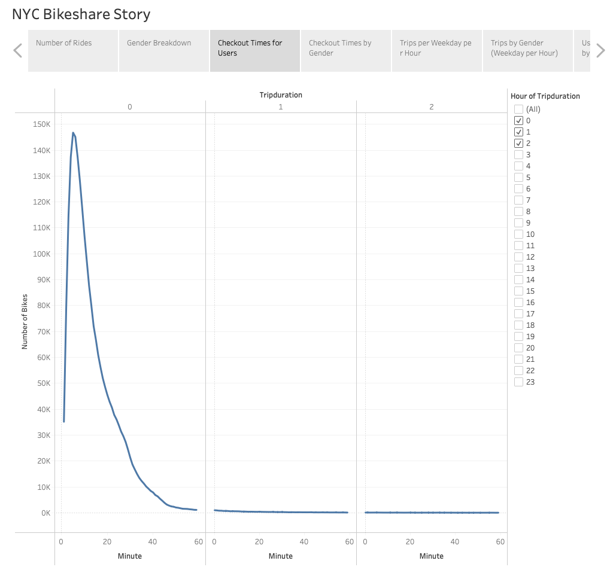

# NY Citibike Analysis with Tableau

## Overview of the analysis
The purpose of this analysis is to work with data visualization software called Tableau to present a business proposal for a bike-sharing company. I will use worksheets, dashboards, and stories in Tableau to visualize key data from a New York Citi Bike dataset.

Here is the [link to the visualizations on Tableau Public](https://public.tableau.com/app/profile/robert.loesch/viz/NYCCitibike_16633661453440/NYCBikeshareStory?publish=yes).

## Results
In this section, I am refering to the visualizations I have in my Tableau Story and describe the results of each visualization underneath the image.

The above image shows the number of bike rentals in NYC.

The above image shows the Gender Breakdown for the bike rentals.

The above image shows the checkout times for users.

The above image shows the checkout times by gender.

The above image shows the trips per weekday per hour.

The above image shows the trips by gender (weekday per hour)

The above image shows the user trips by gender by weekday.

The above image shows the top starting locations

The above image shows the bike repairs.

## Summary
The analysis can be summarized at a high-level as follows:
- In NYC, bike rentals almost all bike rentals have a duration of less than one hour, with the majority also being less than 20 minutes in duration.
- In NYC, the majority of the bike rentals is with male subscribers
- In NYC, weekdays from 6-9am and 5-7pm are times when bike rentals are in high demand
- In NYC, the majority of the bike rental start locations are within the Chelsea, Greenwich Village, and Noho districts

In summary, my conclusion is that bike rentals in NYC are popular for male subscribers on weekdays in certain districts to get to work in the morning rush hour and return from work during the evening rush hour.

This analysis applies specifically to New York City. Des Moines is quite different and the results of starting a bike rental in De Moines might be quite different. In order to determine if a bike rental business would be successful in Des Moines, additional visualizations should be performed with this dataset, for example:
- Include the Birth Year of the bike renter in the Usertype and Gender analysis to get a better understanding of the age of the customer and if age has any influence in bike rentals. 
- Analyse Birth Year with Start Station and Starttime to determine if the age of the customer has any correlation with the station from where the bike is rented from.